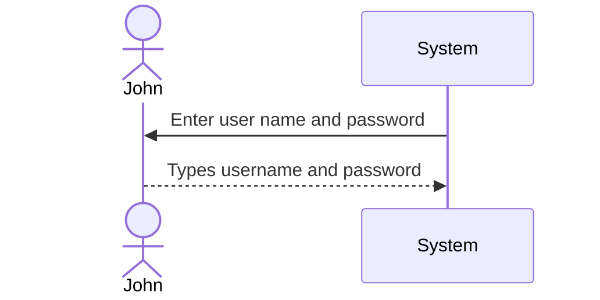

# 1. System Request
Project Sponsor: Bryan Birch, Jacob Hamm, Noah Barrall, Michael Keeports    
Business Need: This project has been initiated to help confusion for CIS students at Messiah University when it comes to finding information for course registration. Currently there are over three different systems used for finding course registration information, and those systems are not always up to date or they can conflict with one another.    

Business Requirement: This application will solve these needs by creating a new source of information for course registration that will combine the existing sources into one to be used by CIS students and faculty.    

Business Values: Students will benefit with less stress and confusion when it comes to course registration. This will also allow to students to register much more efficiently. Faculty will benefit with more structure and less confusion in the process for course registration, as well as helping in meetings between students and their advisors.    

Special Issues or Constraints: The capabilities described are limited to those in the CIS department currently, but this system is to be designed to be replicated and expanded to other departments in the future. One issue for this project is integrating the information from the current systems into this application.

## 2. Work plan
> The original work plan revised after having completed the analysis phase.
### Gantt Chart

# 3. Feasibility Analysis
<h3> Technical Feasibility </h3>

- <b>Familiarity with application:</b> The team has enough information on the applications idea to   feel confident in our ability to create it.  

- <b>Familiarity with technology:</b> The team is not too experienced but the risk is low because it   is all existing systems.   

- <b>Project size:</b> The project will consist of four team members with a year of work combining   other applications which can be considered a Large project.   

- <b>Compatibility:</b> The existing systems are the main focus on the project so the compatibility is   crucial and should be easy to combine them for the project.  

<h3> Organizational Feasibility </h3>

- <b>Is the project strategically aligned with the class?</b> Yes, it will help the university and the   department to make the registering process easier.  

- <b>Project champion:</b> Devi Suberi is the professor of our class  

- <b>Users:</b> The CIS department's students and faculty  

- <b>Other stakeholders:</b> Students and faculty  

# 4. Requirements Definition
<h3> Functional Requirements: </h3>

-  

-  

-  

-  

<h3> Nonfunctional Requirements: </h3>

- <b>Operational</b>  

- <b>Performance</b>  

- <b>Security</b>  

- <b>Cultural and Political</b>  

## 5. Logical Design

> A set of use cases that illustrate the basic processes that the system needs to support.

### 5.1 Sequence Diagram

### 5.2 Use Cases
> *Reference Chapter 4*

#### Use Case Name:  Viewing Course Information

> __ID__ : UC-01

> __Priority__ : High

> __Actor__ : Student/Faculty

> __Description__ : The user wants to view class information.

> __Trigger__ : User wants to view course information of upcoming classes.

> __Type__ : External

> __Preconditions__ :
>   1. The user is currently viewing the application with a stable connection   

| Normal Course: | Information for Steps |
|---|---|
|1.0 Viewing course information||
|1. User opens website|   |
|2. User navigates to the desired course| |
|3. User selects desired course|<-- User clicks on course number|
|4. Window opens up with course information| |
|5. User selects specific section of class||
|6. User views desired information||

> __Postconditions__ :
>   1. User closes out of pop-up window

|Summary Inputs|Source|Summary Outputs| Destination|
|---|---|---|---|
|Opening webpage|Database|List of courses|User|
|Selecting course|Database|Display course information|User|

#### Use Case Name:  Viewing Major/Minor/Concentration Requirements

> __ID__ : UC-02

> __Priority__ : High

> __Actor__ : Student

> __Description__ : The user wants to view major/minor/concentration requirements

> __Trigger__ : User wants to view requirements for their major/minor/concentration

> __Type__ : External

> __Preconditions__ :
>   1. The user is currently viewing the application with a stable connection
>   2. User is aware of their current major/minor/concentration 

| Normal Course: | Information for Steps |
|---|---|
|1.0 View Major/Minor/Concentration Requirements||
|1. User opens website|   |
|2. User selects tab option to view requirements | |
|3. User selects major, minor, or concentration requirements desired||
|4. System displays requirements for selected major, minor, or concentration||
|5. User recieves desired requirements information||

> __Postconditions__ :
>   1. User returns to homepage

|Summary Inputs|Source|Summary Outputs| Destination|
|---|---|---|---|
|Selecting course|Database|Display required courses|User|

#### Use Case Name:  Printing

> __ID__ : UC-03

> __Priority__ : High

> __Actor__ : Student/Faculty

> __Description__ : The user wants to print a hard copy of displayed information on website

> __Trigger__ : User decides to print current page

> __Type__ : External

> __Preconditions__ :
>   1. The user is currently viewing the application with a stable connection
>   2. User is connected to a printer
>   3. User navigates to desired page to print 

| Normal Course: | Information for Steps |
|---|---|
|1.0 Printing||
|1. User selects print button|   |
|2. User customizes page how they want to print | |
|3. User selects print||

> __Postconditions__ :
>   1. Hard copy gets printed
>   2. User receives hard copy from printer

|Summary Inputs|Source|Summary Outputs|Destination|
|---|---|---|---|
|Hitting print button|Current Page|Hard copy of page|Printer|

